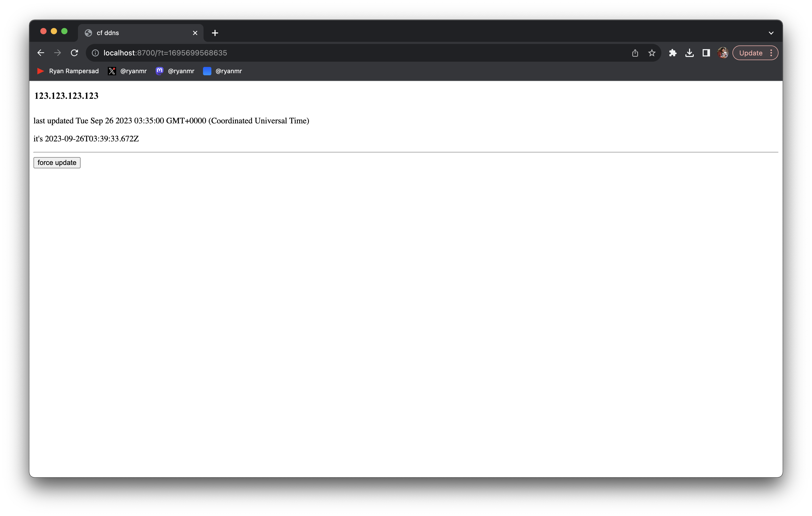

# cloudflare-dns-sync

> sync home ip

## Tech

- [bun](https://bun.sh/)
- [cloudflare](https://developers.cloudflare.com/api/)
- [ifconfig.co](https://ifconfig.co/)
- [elysia](https://elysiajs.com/)

## Cutting edge user interface



This uses revolutionary cutting edge user interface patterns. I mean, it uses no client side JavaScript, uses a form for interaction and uses meta tag refreshes for realtime-ish user experience.

## Usage

To install dependencies:

```bash
bun install
```

To run:

```bash
bun run src/index.ts
```

## Environment variables

Remember to set your environment variables:

```sh
CLOUDFLARE_ACCESS_TOKEN=...
CLOUDFLARE_RECORD_NAME...
CLOUDFLARE_ZONE_ID=...
```

Optionally, there's a [Discord webhook](https://discord.com/developers/docs/resources/webhook):

```
DISCORD_WEBHOOK_URL=...
```

